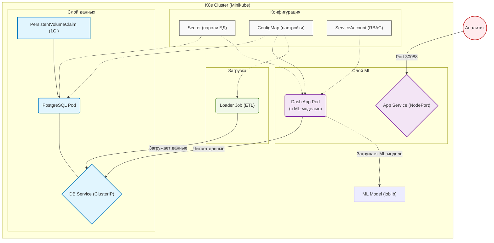
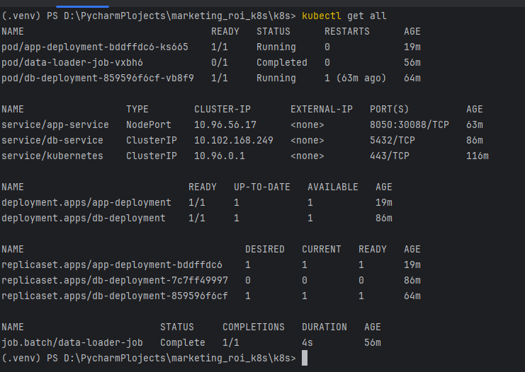
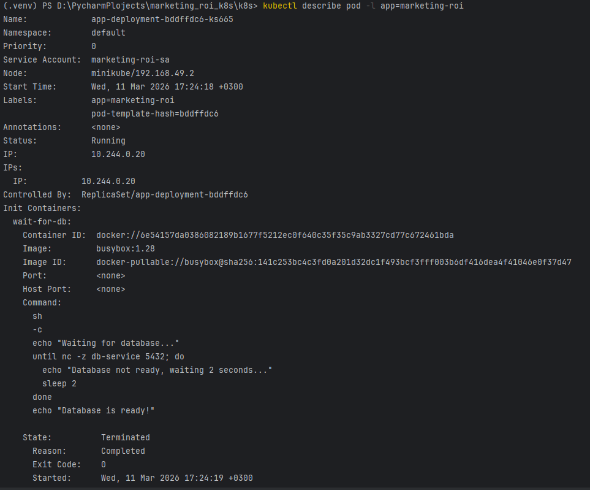
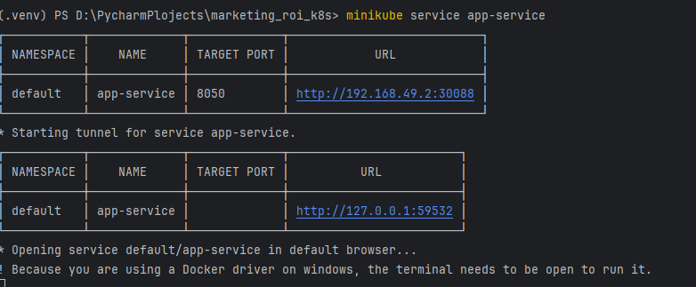
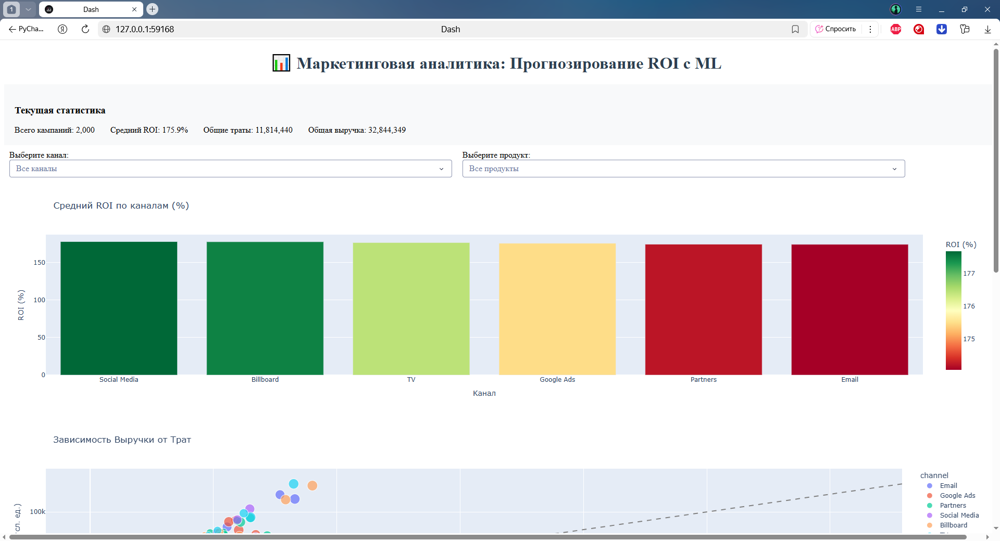

# Лабораторная работа №3. Развертывание аналитического сервиса в кластере Kubernetes

**Выполнил:** [Быков Владимир Валерьевич]  
**Группа:** [БД-251м]  
**Вариант:** 7 (Маркетинговая аналитика / ROI Marketing App)
**Техническое задание (K8s Specific).** Настроить **Readiness Probe** так, чтобы трафик не шел на под, пока он не загрузит ML-модель в память (delay 30s).

---

## 1. Цель работы
Получить практические навыки оркестрации контейнеризированных приложений в среде Kubernetes. Выполнить миграцию архитектуры из Docker Compose в K8s, настроить управление конфигурациями (ConfigMaps/Secrets), обеспечить персистентность данных (PVC), настроить проверки жизнеспособности (Probes) с учетом загрузки ML-модели и привязать кастомный ServiceAccount.

## 2. Технический стек и окружение
- **ОС:** Windows 10
- **Контейнеризация:** Docker 24.x
- **Оркестрация:** Minikube (Driver: Docker), Kubernetes (kubectl)
- **База данных:** PostgreSQL 16 (Alpine)
- **Язык программирования:** Python 3.11
- **Аналитическое приложение:** Dash (Plotly) с ML-моделью
- **Библиотеки:** `psycopg2-binary`, `dash`, `pandas`, `sqlalchemy`, `plotly`, `gunicorn`

---

## 3. Архитектура решения



### Таблица пояснения компонентов архитектуры

| Блок | Компонент | Краткое пояснение |
| :--- | :--- | :--- |
| **Configs** | Secret/ConfigMap/SA | Хранилище паролей, настроек и прав доступа (`ServiceAccount` для RBAC). |
| **Database** | PostgreSQL / PVC | База данных для хранения маркетинговых кампаний. `PVC` обеспечивает сохранность данных. |
| **ML Model** | Dash App | Аналитическое приложение с ML-моделью прогнозирования ROI. Использует `InitContainer` для ожидания БД и специальную `Readiness Probe` для загрузки модели. |
| **Data** | Loader Job | Однократный процесс, наполняющий БД тестовыми данными о маркетинговых кампаниях. |
| **User** | Analyst | Внешний пользователь, получающий доступ к Dash-приложению через `NodePort` (порт 30088). |

---


## 4. Манифесты Kubernetes

### `k8s/01-config-secret.yaml`
```yaml
apiVersion: v1
kind: Secret
metadata:
  name: db-secret
type: Opaque
data:
  POSTGRES_USER: bWFya2V0aW5nX3VzZXI=
  POSTGRES_PASSWORD: c3Ryb25nX3Bhc3N3b3JkXzEyMw==
---
apiVersion: v1
kind: ConfigMap
metadata:
  name: app-config
data:
  POSTGRES_DB: "marketing_db"
  DB_HOST: "db-service"
  DB_PORT: "5432"
  CSV_PATH: "/data/marketing_campaigns.csv"
```

### `k8s/02-pvc.yaml`
```yaml
apiVersion: v1
kind: PersistentVolumeClaim
metadata:
  name: postgres-pvc
spec:
  accessModes:
    - ReadWriteOnce
  resources:
    requests:
      storage: 1Gi
```

### `k8s/03-serviceaccount.yaml`
```yaml
apiVersion: v1
kind: ServiceAccount
metadata:
  name: marketing-roi-sa
  labels:
    app: marketing-roi
```

### `k8s/04-db.yaml`
```yaml
apiVersion: apps/v1
kind: Deployment
metadata:
  name: db-deployment
  labels:
    app: db
spec:
  replicas: 1
  selector:
    matchLabels:
      app: db
  template:
    metadata:
      labels:
        app: db
    spec:
      containers:
      - name: postgres
        image: postgres:16-alpine
        ports:
        - containerPort: 5432
        env:
        - name: POSTGRES_USER
          valueFrom:
            secretKeyRef:
              name: db-secret
              key: POSTGRES_USER
        - name: POSTGRES_PASSWORD
          valueFrom:
            secretKeyRef:
              name: db-secret
              key: POSTGRES_PASSWORD
        - name: POSTGRES_DB
          valueFrom:
            configMapKeyRef:
              name: app-config
              key: POSTGRES_DB
        volumeMounts:
        - mountPath: /var/lib/postgresql/data
          name: db-storage
        resources:
          requests:
            memory: "256Mi"
            cpu: "250m"
          limits:
            memory: "512Mi"
            cpu: "500m"
        livenessProbe:
          exec:
            command:
            - pg_isready
            - -U
            - $(POSTGRES_USER)
            - -d
            - $(POSTGRES_DB)
          initialDelaySeconds: 30
          periodSeconds: 10
        readinessProbe:
          exec:
            command:
            - pg_isready
            - -U
            - $(POSTGRES_USER)
            - -d
            - $(POSTGRES_DB)
          initialDelaySeconds: 5
          periodSeconds: 5
      volumes:
      - name: db-storage
        persistentVolumeClaim:
          claimName: postgres-pvc
---
apiVersion: v1
kind: Service
metadata:
  name: db-service
spec:
  type: ClusterIP
  selector:
    app: db
  ports:
  - port: 5432
    targetPort: 5432
```

### `k8s/05-app.yaml`
```yaml
apiVersion: apps/v1
kind: Deployment
metadata:
  name: app-deployment
  labels:
    app: marketing-roi
spec:
  replicas: 1
  selector:
    matchLabels:
      app: marketing-roi
  template:
    metadata:
      labels:
        app: marketing-roi
    spec:
      serviceAccountName: marketing-roi-sa

      initContainers:
      - name: wait-for-db
        image: busybox:1.28
        command:
        - "sh"
        - "-c"
        - |
          echo "Waiting for database..."
          until nc -z db-service 5432; do
            echo "Database not ready, waiting 2 seconds..."
            sleep 2
          done
          echo "Database is ready!"

      containers:
      - name: dashboard
        image: marketing-roi-app:v1
        imagePullPolicy: Never
        ports:
        - containerPort: 8050
        envFrom:
        - configMapRef:
            name: app-config
        - secretRef:
            name: db-secret
        resources:
          requests:
            memory: "512Mi"
            cpu: "500m"
          limits:
            memory: "1Gi"
            cpu: "1000m"

        livenessProbe:
          httpGet:
            path: /health
            port: 8050
          initialDelaySeconds: 60
          periodSeconds: 30
          failureThreshold: 3

        # Readiness probe - ТЗ: трафик не идет, пока не загружена ML-модель
        # Модель загружается ~25-30 секунд, поэтому initialDelaySeconds = 30
        readinessProbe:
          httpGet:
            path: /ready
            port: 8050
          initialDelaySeconds: 30
          periodSeconds: 5
          failureThreshold: 12
          successThreshold: 1
---
apiVersion: v1
kind: Service
metadata:
  name: app-service
spec:
  type: NodePort
  selector:
    app: marketing-roi
  ports:
  - port: 8050
    targetPort: 8050
    nodePort: 30088
```

### `k8s/06-job.yaml`
```yaml
apiVersion: batch/v1
kind: Job
metadata:
  name: data-loader-job
spec:
  template:
    spec:
      restartPolicy: OnFailure
      containers:
      - name: loader
        image: marketing-roi-app:v1
        imagePullPolicy: Never
        command: ["python", "loader.py"]
        envFrom:
        - configMapRef:
            name: app-config
        - secretRef:
            name: db-secret
        resources:
          requests:
            memory: "128Mi"
            cpu: "100m"
          limits:
            memory: "256Mi"
            cpu: "200m"
```

---

## 5. Скриншот команды kubectl get all


---

## 6. Скриншот команды kubectl describe


---


## 7. Скриншот работающего приложения в браузере



---


